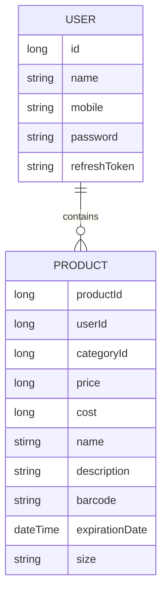

# ProjectManagement
상품 등록 관리 시스템


## Entity 관계도



## SQL DDL
```sql
-- users table (사장님 정보)
if not exists CREATE TABLE users (
    id bigint PRIMARY KEY,
    name VARCHAR(30) comment 사장님 이름,
    mobile VARCHAR(30) comment 사장님 휴대폰 번호,
    password VARCHAR(256) comment 사장님 비밀번호,
    refresh_token VARCHAR(256) comment 갱신용 토큰,
		created_date DATETIME comment 생성 날짜,
		updated_date DATETIME comment 업데이트 날짜
) comment 사장님 회원 정보;


-- products table (상품 정보)
if not exists CREATE TABLE products (
    id bigint PRIMARY KEY,
    user_id bigint comment 등록한 사장님 user_id,
    category_id bigint comment 분류된 카테고리 id,
    price int comment 상품 가격,
    cost int comment 상품 원가,
    name VARCHAR(50) comment 상품 이름,
    description text comment 상품 설명,
    expiration_date DATETIME comment 상품 유효기한,
    size VARCHAR(10) comment 상품 사이즈 (SMALL: 작은 사이즈 / LARGE: 큰 사이즈)
		created_date DATETIME comment 상품 생성 날짜,
		updated_date DATETIME comment 상품 수정 날짜
) comment 상품 정보;

```

## 필요 API 리스트

### 회원 관련
1. 회원 가입
2. 로그인
    1. JWT 인증 발급
3. 로그아웃
4. 회원 탈퇴

### 상품 관련
1. 상품 등록
2. 상품 삭제
3. 상품 수정
4. 상품 리스트 (10개씩 pagination)
    1. 상품 검색
        1. like 검색
        2. 초성 검색
    2. 비로그인 접근 제한
5. 상품 상세


<details><summary>Datetime, TimeStamp 관련 </summary>
    - TimeStamp 는 2038년까지밖에 저장이 안 됨.
    
    
    
    
    - 근데 timestamp 는 UTC 라 시간계산이 용이
</details>
